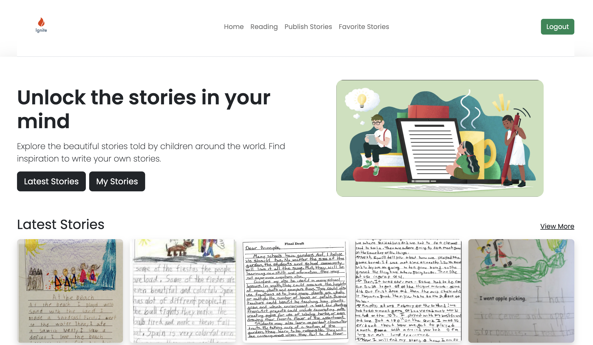

## Barcode: <a href="https://ignite-production.up.railway.app/">Live Demo</a>

## How It's Made:

**Tech used:** EJS, CSS, Bootstrap, JavaScript, Node, Express, MongoDB, Local Authorization through Passport.js, Google Books API 

This website was made for children in grades K-5th grade. It's a writing and reading website where children can upload stories they have written, save favorite stories, and read each other's story. They can also read a book from the Google Books API. 

The website is a full-stack CRUD app built using MVC architecture. MVC architecture helps keep the code organized so that I can go back to easily add, delete, or change the code. 

## Optimizations

Although users can upload PDFs to the website, I'm still working on displaying PDFs to the website. Also, a nice feature would be to allow users to comment on each other's stories. However, since this is a children's website, I debated on whether I should add that feature. I think I could also align the hamburger menu a little better. I am going to try work on that if I get the chance. 

## Lessons Learned:

This is the first time I used Axios to fetch data from the backend using an external API. It was a hard challenge figuring out how to get the ISBN of the books to render the embedded reader. Then rendering the results was also a challenge because so many of the images and ISBNs are undefined. This resulted in errors and the results would not render. I ended up using a ternary operator in the reading-results.ejs file. 

Save favorite stories was also challenging. This required that I change the Story model and add an array so that the user ids can be saved into the array. Then I was able to fetch those arrays from the database to render the favorite page. It required using both clientside JavaScript and serverside JavaScript. 